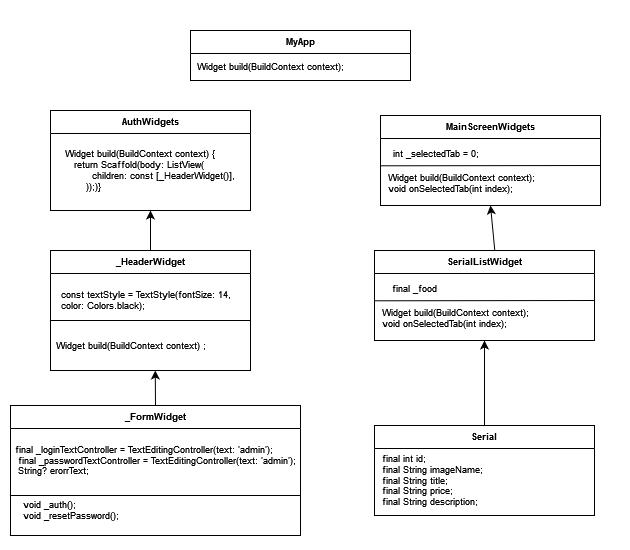

# Диаграмма классов  

 

# Глоссарий

| Класс | Описание |
|:---|:---|
| MyApp | Главный класс - запускает приложение |
| AuthWidgets | Класс авторизации |
| _HeaderWidget | Класс, отрисовывающий хедер |
| _FormWidget | Класс, контролирующие поля ввода логина и пароля |
| MainScreenWidget | Класс, отрисовывающий главный (исользуемый) экран |
| FoodListWidget | Класс, отрисовывающий экран списка еды |
