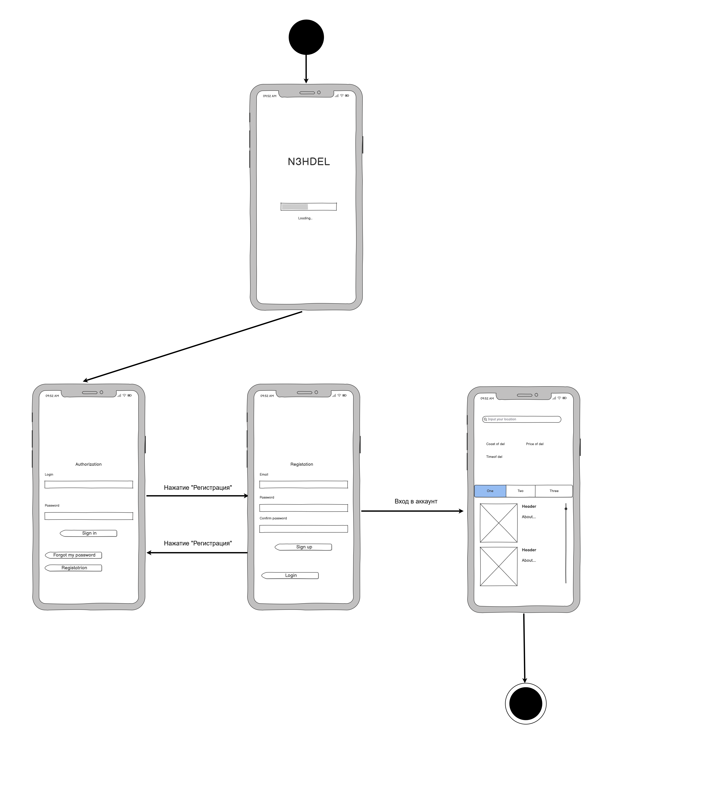
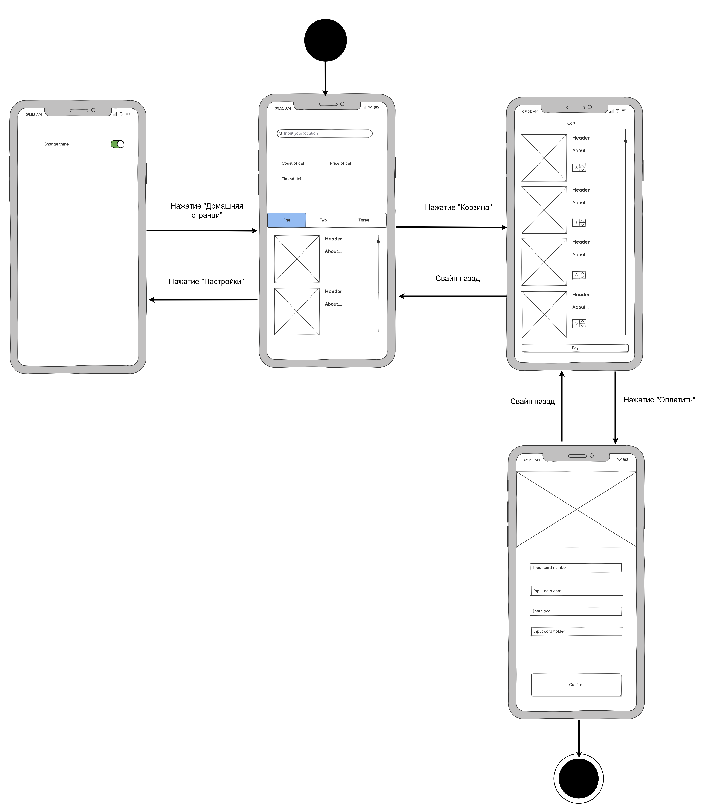
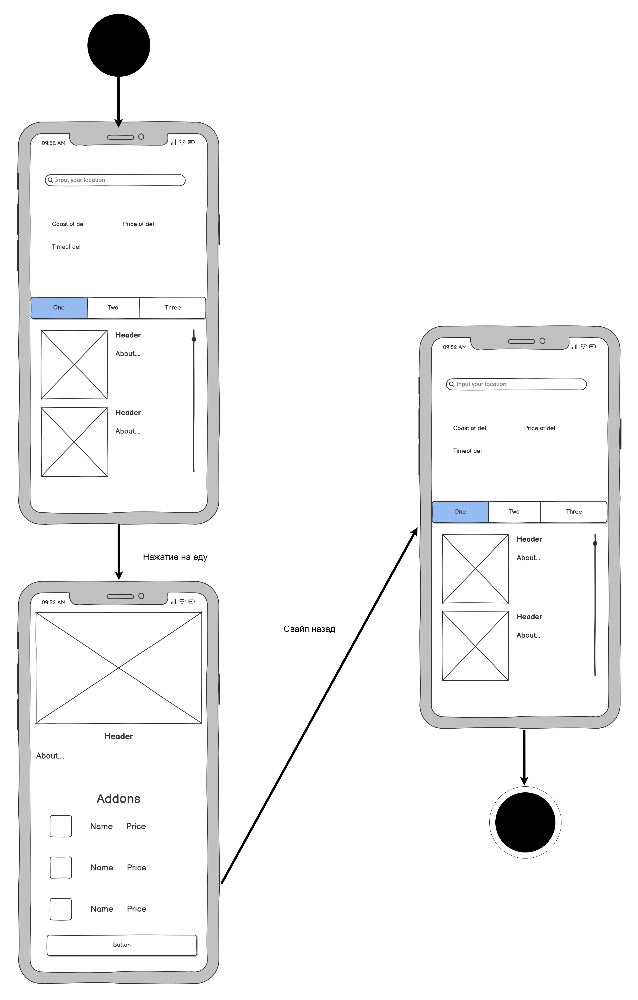

# Диаграммы состояний

# Содержание
1. [Вход в аккаунт](#1)
2. [Действия на главном экране](#2)
3. [Действия на экране списка еды](#3)

### 1. Вход в аккаунт

### 2. Действия на главном экране

  
### 3. Действия на экране списка еды

