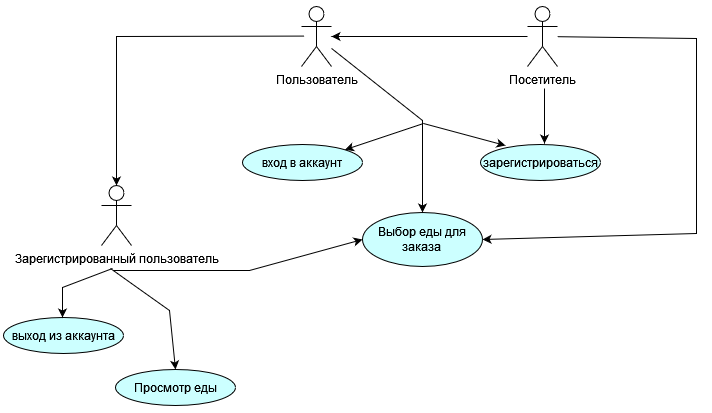

# Диаграмма вариантов использования

 
  
# Глоссарий

| Термин | Определение |
|:--|:--|
| Пользователь | Человек, использующий приложение |
| Зарегистрированный пользователь | Пользователь, ранее зарегистрировавшийся в приложении |
| Посетитель | Пользователь, использующий приложение без авторизации |  
  
# Поток событий 

# Содержание
1 [Актёры](#actors)  
2 [Варианты использования](#use_case)  
2.1 [Войти в аккаунт](#sign_in_to_your_account)  
2.2 [Зарегистрироваться](#sign_up)    
2.3 [Просмотр еды](#view_food_list)  
2.4 [Выйти из аккаунта](#sign_out_from_app)  

<a name="actors"/>

# 1 Актёры

| Актёр | Описание |
|:--|:--|
| Пользователь | Человек, использующий приложение |
| Посетитель | Пользователь, который использует приложение без регистрации в нём |
| Зарегистрированный пользователь | Пользователь, который зарегистрировался в приложении |

<a name="use_case"/>

# 2 Варианты использования

<a name="sign_in_to_your_account"/>

## 2.1 Войти в аккаунт

**Описание.** Вариант использования "Войти в аккаунт" позволяет пользователю войти в учётную запись.  
**Предусловия.** Пользователь выбрал способ "Вход" для входа в приложение.  
**Основной поток.**
1. Приложение отображает окно входа в аккаунт;
2. Пользователь вводит данные;
3. Пользователь подтверждает ввод;
4. Приложение запоминает имя пользователя и загружает его данные;
5. Приложение скрывает окно входа в аккаунт;
6. Вариант использования завершается.

**Дополнительная информация.** Пользователь имеет возможность отменить действие. В случае отмены выполняется альтернативный поток А1.

**Альтернативный поток А1.**
1. Приложение скрывает окно входа в аккаунт;
2. Вариант использования завершается досрочно.

<a name="sign_up"/>

## 2.2 Зарегистрироваться

**Описание.** Вариант использования "Зарегистрироваться" позволяет пользователю создать свой аккаунт в приложении.  
**Предусловия.** Анонимный пользователь захотел зарегистрироваться в приложении, выбрав пункт меню "Регистрация".  
**Основной поток.**
1. Приложение отображает окно регистрации, в котором запрашивает у пользователя ввод данных;
2. Пользователь вводит данные;
3. Пользователь подтверждает ввод;
4. Приложение проверяет введённое имя на совпадение с именами уже зарегистрированных пользователей. Если совпадение выявлено, выполняется альтернативный поток А2;
5. Приложение создает аккаунт пользователя в базе данных;
6. Приложение скрывает окно регистрации;
7. Вариант использования завершается.

**Альтернативный поток А2.**
1. Приложение сообщает пользователю, что пользователь с таким именем уже существует;
2. Приложение запрашивает у пользователя ввод другого имени;
3. Возврат к п.2 основного потока.

**Дополнительная информация.** Пользователь имеет возможность отменить действие до подтверждения ввода. В случае отмены выполняется альтернативный поток А3.

**Альтернативный поток А3.**
1. Приложение скрывает окно регистрации;
2. Вариант использования завершается досрочно.

<a name="view_food_list"/>

## 2.3 Просмотр списка еды

**Описание.** Любой пользователь может просматривать залы по карате.   
**Основной поток.**
1. Приложение отображает главное окно.
2. Пользователь выбирает вкладку еды.
3. Выбирает еду.
4. Выбирает дополнения и ее количество.
5. Добавляет в корзину.
6. Вариант использования завершается.

**Дополнительная информация.** Пользователь имеет возможность вернуться назад.

**Альтернативный поток А4.**
1. Приложение скрывает главное окно;
2. Вариант использования завершается досрочно.

<a name="sign_out_from_app"/>

## 2.4 Выйти из аккаунта

**Описание.** Вариант использования "Выйти из аккаунта" позволяет зарегистрированному пользователю выйти из аккаунта.  
**Предусловия.** Зарегистрированный пользователь нажал на кнопку "Выход".  
**Основной поток.**
1. Приложение сбрасывает настройки под пользователя и переводит его в разряд анонимных пользователей;
2. Вариант использования завершается.

