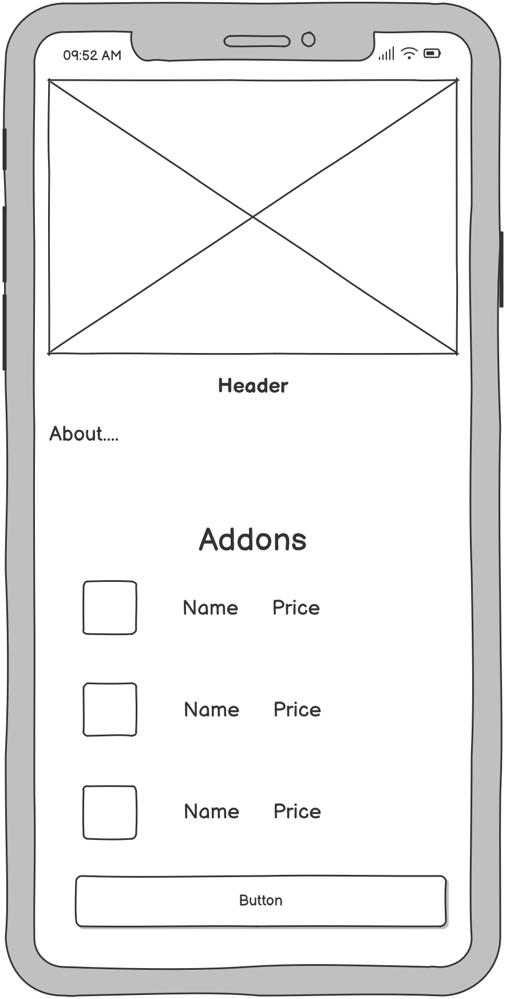

# Delivry_app

## **Оглавление**
- [1. Введение](#intro)
- [2. Требования пользователя](#user_requirements)
  - [2.1 Программные интерфейсы](#interfaces)
  - [2.2 Интерфейс пользователя](#ui)
  - [2.3 Характеристики пользователей](#user_characteristics)
  - [2.4 Предположения и зависимости](#assumptions)
- [3. Системные требования](#system_requirements)
  - [3.1 Функциональные требования](#functional_requirements)
  - [3.2 Нефункциональные требования](#non_functional_requirements)

## **1. Введение**

**Название проекта:** N3DEL

**Технологии и инструменты разработки:**

•	Язык разработки: Dart.

•	Фреймворк для создания UI: FLUTTER.

•	Среда разработки: VS Code.

**Описание проекта:**  
Проект представляет собой мобильное приложение для покупки и доставки еды.

**Границы проекта:**  
Приложение не предоставляет функций комментирования фильмов.

## **2. Требования пользователя**

### **2.1 Программные интерфейсы:**

Продукт будет взаимодействовать с несколькими внешними системами:

•	Google Maps API/ Yandex Maps API для отображения фильмов, информации о них, актерах.

•	Firebase Authentication для авторизации и хранения данных пользователей (тренеров, администраторов).

### **2.2 Интерфейс пользователя:**

Приложение будет содержать следующие основные интерфейсы:

• Страница авторизации: Экран для ввода данных пользователя (логин и пароль).
  
  

• Страница регистрации: Экран для ввода данных пользователя (логин и пароль).
  
    

• Страница с едой/домашняя страница.
  
  

• Страница с подробным описанием еды.
  
  

• Страница с корзиной: добавленной едой.
  
  

• Страница настроек.
  
  

Пример взаимодействия:

| Действие пользователя                          | Реакция системы                                               |
|------------------------------------------------|---------------------------------------------------------------|
| Ввод логина и пароля, нажимает "Войти"         | Проверка данных и вход в систему                              |
| Нажимает на еду                                | Открывается на странице с едой                                |
| Нажимает на настройки                          | Открывается на странице с настройками                         |
| Скролит вниз                                   | Возможность просмотр всей еды                                 |

### **2.3 Характеристики пользователей:**

•	Люди: Возраст 16+, с базовыми навыками работы со смартфонов. Уровень технической грамотности — средний.

### **2.4 Предположения и зависимости:**

•	Все пользователи должны иметь подключение к интернету для синхронизации данных с облаком.

•	Приложение будет работать только на устройствах с Android 6.0 и выше.

## **3. Системные требования**

### **3.1 Функциональные требования:**

1.	Приложение должно позволять пользователям просматривать еду и ее описание.
  
2.	Пользователи должны иметь возможность добавлять и удалять еду из корзины.
	
3.	Авторизация через Firebase должна быть обязательной для всех пользователей.
	
4.	Приложение должно поддерживать управление жестами для выполнения определённых действий.
   
5.	Приложение должно поддерживать синхронизацию данных с облаком (Firebase).

### **3.2 Нефункциональные требования:**

•	Надёжность: Приложение должно быть устойчивым к потерям соединения с интернетом, с возможностью локального хранения данных и последующей синхронизации.

•	Безопасность: Данные пользователей и залов должны быть защищены, а авторизация — проводиться через надёжную систему (например, Firebase Authentication).

•	Производительность: Приложение должно загружаться и работать плавно на большинстве современных устройств.

•	Удобство использования: Интерфейс должен быть интуитивно понятным, особенно для пользователей с базовыми техническими навыками.
